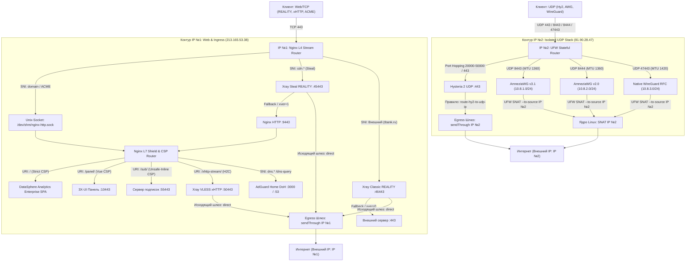

# 🛡️ Dual ip GateWay Node (Production Release v1.1.0)
### Автоматизированный узел сетевой маскировки и туннелирования: OS Hardening + BBR + Nginx L4/L7 + 3X-UI + Xray v26.7.28 Pinned + VLESS xHTTP (Native H2C) + ML-KEM-768 + Multi-Port REALITY + Hysteria 2 + AWG v3/v2 + WireGuard Native + AdGuard Home DoH

[](https://ubuntu.com)
[](https://github.com/XTLS/Xray-core)
[](https://github.com/mhsanaei/3x-ui)
[](LICENSE)
[](LICENSE)

<p align="center">
  <b>Комплексный инженерный инструмент для развёртывания устойчивой к блокировкам сетевой инфраструктуры.</b><br>
  Реализует топологию Dual-IP (разведение чистого веб-трафика и изолированного UDP VPN по разным сетевым интерфейсам), постквантовое шифрование, аппаратный L4-роутинг Nginx Mainline и полноценную веб-маскировку.
</p>

---

## 📑 Содержание

1. [Архитектура и сетевая топология](#-архитектура-и-сетевая-топология)
2. [Ключевые функциональные возможности](#-ключевые-функциональные-возможности)
3. [Системные требования и быстрый старт](#-системные-требования-и-быстрый-старт)
4. [Параметры мастера установки](#-параметры-мастера-установки)
5. [Конфигурации инбаундов Xray-core](#-конфигурации-инбаундов-xray-core)
6. [Подписки и совместимость с клиентами](#-подписки-и-совместимость-с-клиентами)
7. [Интеграция DNS AdGuard Home (DoH)](#-интеграция-dns-adguard-home-doh)
8. [Инженерная диагностика и аудит](#-инженерная-диагностика-и-аудит)
9. [Резервное копирование и откат](#-резервное-копирование-и-откат)
10. [Лицензия](#-лицензия)

---

## 🏗️ Архитектура и сетевая топология

Инфраструктура построена по схеме **Dual-IP Model 1**, исключающей деградацию репутации основного домена из-за активности VPN-трафика:

* **IP №1 (Web Ingress & Egress):** Принимает входящие TCP-соединения на порт `:443` (Nginx L4 Stream). Обслуживает маскировочный сайт, веб-панель 3X-UI, протоколы VLESS REALITY и VLESS xHTTP. Исходящий трафик прокси принудительно маршрутизируется через директиву ядра `sendThrough: IP#1` — внешние веб-ресурсы и чекеры скорости фиксируют исключительно IP №1.
* **IP №2 (Isolated UDP Stack & Egress):** Принимает входящий UDP-трафик протоколов Hysteria 2, AmneziaWG (v3.1 и v2.0) и чистого WireGuard RFC. Исходящий трафик этих протоколов изолирован на уровне ядра через шлюз `direct-udp` (`sendThrough: IP#2`) и правила трансляции SNAT в UFW.



---

## ⚙️ Ключевые функциональные возможности

* **Строгая симметрия Egress-маршрутизации (`sendThrough`):**  
  Решена проблема перетекания сетевых следов при наличии нескольких адресов. Веб-протоколы (REALITY, xHTTP) выходят в Интернет исключительно с IP №1, туннельные протоколы (Hysteria 2, AmneziaWG, WireGuard) — строго с IP №2.
* **VLESS xHTTP (Native H2C Stream-One) + ML-KEM-768:**  
  Полнодуплексный двусторонний стриминг поверх мультиплексированного HTTP/2 (`proxy_http_version 2;`) между Nginx и Xray. Интегрировано постквантовое шифрование ML-KEM-768 (`vlessenc`), рандомизированный паддинг `xPaddingBytes: 100-500` и заголовок `X-Amz-Meta-Trace`.
* **Матрица REALITY (L4 Stream Router):**  
  * *Steal-Oneself:* маршрутизация поддоменов первого уровня на локальные сокеты Xray с защитой от зацикливания через PROXY protocol v1 (`xver: 1`) на порт `:9443`.
  * *Classic External:* работа с доверенными внешними SNI (автоматический бенчмарк задержки до пула хостов через TLS 1.3).
* **Стек UDP-туннелей (Четыре независимых движка):**  
  * *Hysteria 2:* UDP QUIC на порту `:443` с поддержкой Port Hopping (`20000:50000/udp`).
  * *AmneziaWG v3.1:* расширенная обфускация пакетов (h1–h4, jc, jmin/jmax, s1–s4) в подсети `10.8.1.0/24`.
  * *AmneziaWG v2.0 (Legacy):* совместимость с роутерами KeeneticOS и OpenWrt в подсети `10.8.2.0/24`.
  * *Native WireGuard RFC:* чистый интерфейс WireGuard в подсети `10.8.3.0/24` с готовым конфигурационным файлом `/root/wireguard-client.conf`.
* **Выравнивание размера пакетов (TCP MSS Clamping):**  
  Принудительная фиксация MSS на уровне ядра через таблицу `*mangle` брандмауэра (`TCPMSS 1320` для AWG и `TCPMSS 1380` для WireGuard) для ликвидации Path MTU Discovery Blackhole в сотовых сетях.
* **Зональный Content Security Policy (Zonal CSP):**  
  * *Веб-маскировка:* бескомпромиссный Zero-Trust заголовок без `'unsafe-inline'`.
  * *Веб-интерфейс 3X-UI:* разрешающий профиль для Vue.js и WebSockets.
  * *Сервер подписок:* передача `'unsafe-inline'` и `'unsafe-eval'`, обеспечивающая выполнение скрипта инициализации данных подписки `window.__SUB_PAGE_DATA__` во всех современных браузерах.
* **Закрепление ядра Xray-core v26.7.28 (Pinned):**  
  Гарантия стабильности и поддержка спецификации `vlessenc` без риска поломки при фоновых автообновлениях.

---

## 🚀 Системные требования и быстрый старт

### Требования к серверу:
* **Архитектура:** x86_64 (amd64) или ARM64 (aarch64).
* **ОС:** Ubuntu 22.04 / 24.04 / 26.04 LTS или Debian 12 / 13.
* **Ресурсы:** Минимум 1 vCPU, 1 ГБ RAM (при 512 МБ требуется swap), 10 ГБ на диске.
* **Сеть:** 1 или 2 публичных IPv4 адреса.
* **DNS:** Домен и поддомены (`domain.com`, `cdn.domain.com`, `cdn2.domain.com`, `dns.domain.com`) должны быть направлены на сервер.

> [!CAUTION]
> ### ⚠️ Настройка DNS в Cloudflare
> Все A-записи домена и поддоменов в личном кабинете Cloudflare должны находиться строго в режиме **DNS-Only (Серое облако)**.  
> Проксирование через Cloudflare (Оранжевое облако) блокирует протоколы REALITY, разрушает мультиплексирование L4 Stream и нарушает прохождение UDP-пакетов.

### Установка:

Запустите команду под пользователем `root`:

```bash
bash <(curl -fsSL https://raw.githubusercontent.com/ВАШ_АККАУНТ/РЕПОЗИТОРИЙ/main/install.sh)
```

Резервный запуск через `wget`:

```bash
wget -qO- https://raw.githubusercontent.com/ВАШ_АККАУНТ/РЕПОЗИТОРИЙ/main/install.sh | bash
```

---

## 📋 Параметры мастера установки

| Этап | Параметр | По умолчанию | Описание |
| :--- | :--- | :--- | :--- |
| **Режим** | Режим работы | `2` (при наличии БД) | `1` — Clean Install (чистая база, генерация клиента Test); `2` — Safe Migration (100% сохранение клиентов, ключей и UUID). |
| **0** | Топология адресов | Автоопределение | Ввод IP №1 (Web/TCP) и IP №2 (UDP VPN). При совпадении система переходит в Single-IP режим. |
| **0** | Гео-профиль | Автоопределение | Оптимизация резолверов (Яндекс DNS 77.88.8.8 vs Cloudflare 1.1.1.1) и зеркал загрузки пакетов. |
| **1** | Доменная зона | — | Основной домен (направлен на IP#1) и поддомен UDP (направлен на IP#2). |
| **2** | Системный Hardening | `y` | Тюнинг TCP BBR, FQ, somaxconn 65535, отключение IPv6, включение `net.ipv4.ip_nonlocal_bind = 1`. |
| **2** | SSH-периметр | Текущий порт | Смена порта SSH, блокировка входа по паролю, генерация ключей Ed25519, интеграция с Fail2ban. |
| **3** | Секретные пути | Случайные URI | Настройка закрытых URI для панели управления, сервера подписок и xHTTP-стрима. |
| **4** | Матрица REALITY | `y` (`:45443` / `:46443`)| Привязка Steal-Oneself к поддоменам и Classic к внешним SNI с замером задержки RTT. |
| **6** | UDP-туннели | `y` | Выбор активации Hysteria 2 (с Port Hopping), AmneziaWG v3.1, AmneziaWG v2.0 и Native WireGuard RFC. |
| **7** | Приватный DoH | `y` (`dns.domain`)| Развёртывание AdGuard Home DoH со сплит-DNS и токенизацией `ClientID`. |

> [!IMPORTANT]
> **Обязательное действие после завершения работы установщика:**  
> 1. Откройте **новое отдельное окно терминала** и проверьте доступ к серверу по SSH на установленном порту.  
> 2. В исходной консоли выполните команду: `reboot`.  
> После перезагрузки сетевые параметры ядра, таблицы брандмауэра и службы активируются в штатном режиме.

---

## 📄 Конфигурации инбаундов Xray-core

<details>
<summary><b>1. VLESS xHTTP Stream-One + ML-KEM-768 + XMUX + Vision (Порт :50443)</b></summary>

```json
{
  "listen": "127.0.0.1",
  "port": 50443,
  "protocol": "vless",
  "tag": "in-xhttp-stream",
  "settings": {
    "clients": [
      {
        "id": "ВАШ_UUID",
        "flow": "xtls-rprx-vision",
        "email": "Test",
        "subId": "SUB_Test",
        "enable": true
      }
    ],
    "decryption": "mlkem768_КЛЮЧ_СЕРВЕРА",
    "encryption": "mlkem768_КЛЮЧ_КЛИЕНТА"
  },
  "sniffing": {
    "enabled": true,
    "destOverride": ["http", "tls", "quic", "fakedns"]
  },
  "streamSettings": {
    "network": "xhttp",
    "xhttpSettings": {
      "path": "/Stream-One-Path/",
      "host": "yourdomain.online",
      "mode": "stream-one",
      "noSSEHeader": true,
      "xPaddingBytes": "100-500",
      "xPaddingObfsMode": true,
      "xPaddingKey": "X-Amz-Meta-Trace",
      "xmux": {
        "maxConcurrency": "0",
        "maxConnections": "1-3",
        "cMaxReuseTimes": "300-600",
        "hMaxRequestTimes": "600-900",
        "hMaxReusableSecs": "1800-3000",
        "hKeepAlivePeriod": 600
      },
      "enableXmux": true
    },
    "security": "none"
  }
}
```
</details>

<details>
<summary><b>2. VLESS REALITY Steal-Oneself (Порт :45443, Fallback :9443, xver 1)</b></summary>

```json
{
  "listen": "127.0.0.1",
  "port": 45443,
  "protocol": "vless",
  "tag": "in-steal-reality",
  "settings": {
    "clients": [
      {
        "id": "ВАШ_UUID",
        "flow": "xtls-rprx-vision",
        "email": "Test",
        "subId": "SUB_Test",
        "enable": true
      }
    ],
    "decryption": "none"
  },
  "streamSettings": {
    "network": "tcp",
    "security": "reality",
    "tcpSettings": {
      "acceptProxyProtocol": true,
      "header": { "type": "none" }
    },
    "realitySettings": {
      "show": false,
      "xver": 1,
      "target": "127.0.0.1:9443",
      "dest": "127.0.0.1:9443",
      "serverNames": ["cdn.yourdomain.online"],
      "privateKey": "ВАШ_PRIVATE_KEY",
      "minClientVer": "1.0.0",
      "shortIds": ["ВАШ_SHORT_ID"],
      "settings": {
        "publicKey": "ВАШ_PUBLIC_KEY",
        "fingerprint": "firefox",
        "spiderX": "/"
      }
    }
  }
}
```
</details>

<details>
<summary><b>3. Hysteria 2 UDP (Порт :443 на IP №2, Auth == Password)</b></summary>

```json
{
  "listen": "81.90.28.47",
  "port": 443,
  "protocol": "hysteria",
  "tag": "in-hysteria2",
  "settings": {
    "clients": [
      {
        "auth": "ТОКЕН_АВТОРИЗАЦИИ",
        "password": "ТОКЕН_АВТОРИЗАЦИИ",
        "email": "Test",
        "enable": true
      }
    ],
    "version": 2
  },
  "streamSettings": {
    "network": "hysteria",
    "hysteriaSettings": {
      "version": 2,
      "udpIdleTimeout": 60,
      "masquerade": { "type": "proxy", "url": "http://127.0.0.1:80" }
    },
    "security": "tls",
    "tlsSettings": {
      "serverName": "cdn2.yourdomain.online",
      "minVersion": "1.3",
      "maxVersion": "1.3",
      "certificates": [
        {
          "certificateFile": "/etc/letsencrypt/live/cdn2.yourdomain.online/fullchain.pem",
          "keyFile": "/etc/letsencrypt/live/cdn2.yourdomain.online/privkey.pem"
        }
      ],
      "alpn": ["h3"]
    }
  }
}
```
</details>

<details>
<summary><b>4. Native WireGuard RFC (Порт :47443 на IP №2, MTU 1420)</b></summary>

```json
{
  "listen": "81.90.28.47",
  "port": 47443,
  "protocol": "wireguard",
  "tag": "in-wireguard-native",
  "settings": {
    "secretKey": "СЕРВЕРНЫЙ_PRIVATE_KEY",
    "peers": [
      {
        "publicKey": "КЛИЕНТСКИЙ_PUBLIC_KEY",
        "allowedIPs": ["10.8.3.3/32"],
        "keepAlive": 25,
        "email": "Test"
      }
    ],
    "mtu": 1420,
    "noKernelTun": false
  }
}
```
</details>

<details>
<summary><b>5. Раздельные исходящие шлюзы Xray (Strict sendThrough)</b></summary>

```json
{
  "outbounds": [
    {
      "tag": "direct",
      "protocol": "freedom",
      "sendThrough": "213.165.53.38",
      "settings": {
        "finalRules": [
          {"action": "allow", "ip": ["127.0.0.1"], "port": "53"},
          {"action": "allow", "ip": ["10.8.1.0/24", "10.8.2.0/24", "10.8.3.0/24"]},
          {"action": "block", "ip": ["geoip:private"]},
          {"action": "allow"}
        ]
      },
      "streamSettings": {
        "sockopt": { "domainStrategy": "ForceIPv4" }
      }
    },
    {
      "tag": "direct-udp",
      "protocol": "freedom",
      "sendThrough": "81.90.28.47",
      "settings": {
        "finalRules": [
          {"action": "allow", "ip": ["127.0.0.1"], "port": "53"},
          {"action": "block", "ip": ["geoip:private"]},
          {"action": "allow"}
        ]
      },
      "streamSettings": {
        "sockopt": { "domainStrategy": "ForceIPv4" }
      }
    },
    {
      "tag": "blocked",
      "protocol": "blackhole",
      "settings": {}
    }
  ],
  "routing": {
    "domainStrategy": "IPIfNonMatch",
    "rules": [
      {
        "type": "field",
        "inboundTag": ["in-hysteria2"],
        "outboundTag": "direct-udp",
        "ruleTag": "route-hy2-to-udp-ip"
      },
      {
        "type": "field",
        "ip": ["127.0.0.1"],
        "port": "53",
        "outboundTag": "direct"
      },
      {
        "type": "field",
        "ip": ["geoip:private"],
        "outboundTag": "blocked"
      },
      {
        "type": "field",
        "protocol": ["bittorrent"],
        "outboundTag": "blocked"
      }
    ]
  }
}
```
</details>

---

## 📱 Подписки и совместимость с клиентами

Служебные реквизиты доступа и ключи сохраняются в защищенном локальном файле `/root/vpn_credentials.txt` (`chmod 600`).  
В режиме чистой установки генерируются следующие точки подключения:

* **Адаптивная подписка (Base64 / Clash Auto-Detect):**  
  `https://yourdomain.online/my-post-key/SUB_Test`  
  *(При открытии в веб-браузере отдается интерактивная HTML-страница со статистикой и кнопками копирования ключей; при запросе клиентами — сырой Base64 или YAML).*
* **Выделенная подписка JSON (Sing-box / Happ / SFI / Karing):**  
  `https://yourdomain.online/my-post-key/sub-json/SUB_Test`
* **Выделенная подписка Clash / Mihomo YAML:**  
  `https://yourdomain.online/sub-clash/SUB_Test`
* **Конфигурационный файл WireGuard RFC:**  
  `/root/wireguard-client.conf` (MTU 1420, TCP MSS 1380).

### Матрица клиентской совместимости:

| Клиентское ПО | Платформа | VLESS REALITY | VLESS xHTTP + ML-KEM-768 | Hysteria 2 | AmneziaWG (v3/v2) | WireGuard Native |
| :--- | :--- | :---: | :---: | :---: | :---: | :---: |
| **v2rayNG** | Android | ✔️ | ✔️ (Xray core) | ✔️ | ❌ | ❌ |
| **v2rayN** (v6.40+) | Windows | ✔️ | ✔️ (Xray core) | ✔️ | ❌ | ❌ |
| **Happ Proxy** | iOS, iPadOS | ✔️ | ✔️ (Xray core) | ✔️ | ✔️ (AWG3) | ✔️ |
| **NekoBox (NB+)** | Android | ✔️ | ❌ *(нет vlessenc)* | ✔️ | ✔️ | ✔️ |
| **Mihomo Party / Clash Verge** | Desktop | ✔️ | ✔️ | ✔️ | ❌ | ❌ |
| **KeeneticOS / OpenWrt** | Роутеры | ✔️ | ✔️ | ✔️ | ✔️ (AWG v2) | ✔️ (.conf) |

---

## 🌐 Интеграция DNS AdGuard Home (DoH)

Локальный резолвер AdGuard Home изолирован на `127.0.0.1:3000` и обслуживает запросы через защищенный Nginx-шлюз с проверкой токена `ClientID`. Прямой порт 53 из внешней сети закрыт.

* **Панель управления DNS:** `https://dns.yourdomain.online/`
* **DoH URL для роутеров:** `https://dns.yourdomain.online/dns-query/home-router`

### Настройка на Keenetic (KeeneticOS 3.x / 4.x):
1. Откройте веб-интерфейс -> **«Сетевые правила»** -> **«Интернет-фильтр»** (вкладка «Серверы DNS»).
2. Добавьте сервер DNS:
   * **Адрес DNS (Bootstrap):** `77.88.8.8` или `1.1.1.1` *(указывать внешний IP VPS запрещено)*;
   * **Протокол:** `DNS-over-HTTPS (DoH)`;
   * **URL-адрес:** `https://dns.yourdomain.online/dns-query/home-router`;
   * **SNI:** `dns.yourdomain.online`.
3. Активируйте чекбокс **«Игнорировать DNS провайдера»** и сохраните параметры.

---

## 🩺 Инженерная диагностика и аудит

Комплексная проверка состояния сетевого стека и служб:

```bash
# 1. Проверка синтаксиса и статуса Nginx Mainline
nginx -t && systemctl status nginx --no-pager

# 2. Инспекция Unix-сокета Nginx в оперативной памяти
ls -la /dev/shm/nginx-http.sock

# 3. Верификация ответа веб-маскировки DataSphere Enterprise (HTTP/2)
curl -Iv --http2 https://yourdomain.online

# 4. Проверка изоляции VLESS xHTTP (строго HTTP 404 на GET без полезной нагрузки)
curl -Iv --http2 https://yourdomain.online/Stream-One-Path/

# 5. Инспекция локальных слушающих сокетов
ss -tlnp | grep -E '10443|55443|50443|45443|46443|9443|3000'

# 6. Инспекция UDP-сокетов (Hysteria 2, WireGuard, AWG на IP №2)
ss -ulnp | grep -E '443|8443|8444|47443'

# 7. Проверка правил UFW, SNAT на IP №2 и MSS Clamping
ufw status verbose
iptables -t nat -L POSTROUTING -n -v
iptables -t mangle -L FORWARD -n -v

# 8. Проверка версии зафиксированного бинарника Xray-core
/usr/local/x-ui/bin/xray version

# 9. Инспекция записей БД 3X-UI SQLite
sqlite3 /etc/x-ui/x-ui.db "SELECT id, remark, port, protocol, enable FROM inbounds;"
sqlite3 /etc/x-ui/x-ui.db "SELECT id, email, sub_id, enable FROM clients;"
sqlite3 /etc/x-ui/x-ui.db "SELECT id, remark, address, port, path, sni FROM hosts;"
```

---

## 💾 Резервное копирование и откат

### Создание атомарного горячего бэкапа:
```bash
python3 -c "import sqlite3; c=sqlite3.connect('/etc/x-ui/x-ui.db'); c.execute('PRAGMA wal_checkpoint(FULL);'); c.close()" 2>/dev/null || true
tar -czvf /root/backup_vpn_$(date +%F_%H%M%S).tar.gz \
  /etc/x-ui \
  /etc/nginx \
  /etc/letsencrypt \
  /etc/ssl/acme \
  /opt/AdGuardHome/AdGuardHome.yaml \
  /var/www/html \
  /etc/ufw/before.rules 2>/dev/null || true
chmod 600 /root/backup_vpn_*.tar.gz
```

### Восстановление системы:
```bash
systemctl stop x-ui nginx AdGuardHome 2>/dev/null || true
rm -f /etc/x-ui/x-ui.db-wal /etc/x-ui/x-ui.db-shm
tar -xzvf /root/backup_vpn_ГГГГ-ММ-ДД_ЧЧММСС.tar.gz -C /
nginx -t && systemctl start nginx x-ui AdGuardHome
```

---

## 📄 Лицензия

Проект распространяется под условиями открытой лицензии **MIT**. Полный юридический текст представлен в файле [LICENSE](LICENSE).
```
