# 🛡️ Hardened Master Engine v3.5 Dual-IP Consolidated

Техническая документация узла сетевой маскировки и туннелирования трафика: архитектура Dual-IP Model 1, OS Hardening, TCP BBR, Nginx L4 Stream Router, 3X-UI, Xray Core v26.7.28 (Pinned), VLESS xHTTP (Native H2 Stream-One / ML-KEM-768), VLESS REALITY (Steal-Oneself со Stub 11443 и Classic), Hysteria 2, AdGuard Home DoH, нативный сервер AmneziaWG в ядре Linux (DKMS Bare-Metal awg0, профиль AWG3), сетевой экран UFW и шлюз управления DataSphere SSO Hub.

---

## 📑 Содержание

1. [Сетевая топология и архитектура Dual-IP](#1-сетевая-топология-и-архитектура-dual-ip)
2. [Матрица сетевых сокетов и портов](#2-матрица-сетевых-сокетов-и-портов)
3. [Веб-маскировка и административный шлюз (DataSphere SSO)](#3-веб-маскировка-и-административный-шлюз-datasphere-sso)
4. [Параметры обфускации AmneziaWG (Профиль AWG3)](#4-параметры-обфускации-amneziawg-профиль-awg3)
5. [Маршрутизация, NAT и безопасность (UFW)](#5-маршрутизация-nat-и-безопасность-ufw)
6. [Системные требования и развёртывание](#6-системные-требования-и-развёртывание)
7. [Параметры мастера установки](#7-параметры-мастера-установки)
8. [Конфигурации инбаундов Xray-core, Nginx и ядра awg0](#8-конфигурации-инбаундов-xray-core-nginx-и-ядра-awg0)
9. [Клиентские подписки и логика назначения DNS](#9-клиентские-подписки-и-логика-назначения-dns)
10. [Интеграция приватного DoH AdGuard Home](#10-интеграция-приватного-doh-adguard-home)
11. [Диагностика, аудит и мониторинг](#11-диагностика-аудит-и-мониторинг)
12. [Резервное копирование и восстановление](#12-резервное-копирование-и-восстановление)

---

## 1. Сетевая топология и архитектура Dual-IP

Входящий и исходящий трафик физически и логически разделен между двумя независимыми внешними IPv4-адресами:

1. **IP №1 (Web / TCP Ingress & Egress):**
   * **Порт 80:** Привязан к `${WAN_IP_WEB}:80`. Обслуживает запросы валидации Certbot ACME HTTP-01 (`/.well-known/acme-challenge/`). Остальной входящий трафик перенаправляется на HTTPS (HTTP 301).
   * **Порт 443:** Привязан к `${WAN_IP_WEB}:443`. Модуль `ngx_stream_core_module` выполняет L4-маршрутизацию без дешифрования на основе `ssl_preread`:
     * Запросы с основным доменом (`yourdomain.online`), поддоменом DNS (`dns.yourdomain.online`) и UDP-поддоменом передаются во внутренний сокет `/dev/shm/nginx-http.sock`;
     * Запросы с поддоменом Steal REALITY (`cdn.yourdomain.online`) направляются на локальный инбаунд Xray (`127.0.0.1:45443`);
     * Запросы с внешним SNI (`gateway.icloud.com`) направляются на инбаунд Xray Classic REALITY (`127.0.0.1:46443`);
     * Запросы по прямому IP-адресу или с неизвестным SNI сбрасываются директивой `ssl_reject_handshake on` (Zero-SNI Shield).
   * **Stub 11443 (Steal Fallback):** Инбаунд Steal REALITY передает не-REALITY соединения с заголовком PROXY protocol v1 (`xver: 1`) на виртуальный хост `02-steal-stub.conf` (`127.0.0.1:11443`), который согласует HTTP/2 и возвращает `404 Not Found`, исключая циклические редиректы.
   * **Исходящая маршрутизация (Egress IP1):** Весь исходящий веб-трафик Xray (outbound `direct`) зафиксирован через директиву `sendThrough: <WAN_IP_WEB>`.

2. **IP №2 (Isolated UDP Stack Ingress & Egress):**
   * **TCP-периметр:** Входящие порты `:80/tcp` и `:443/tcp` на адресе IP №2 заблокированы в фаерволе UFW (`DENY IN`), исключая обнаружение веб-сервисов и TLS-сертификатов при сканировании.
   * **Hysteria 2:** Базовый сокет `443/udp` на IP №2. Пул динамической ротации портов `20000:35000/udp` перенаправляется на порт 443 средствами iptables PREROUTING.
   * **Native Kernel AmneziaWG (awg0):** Базовый сокет ядра `8443/udp` на IP №2. Скоростной пул `35001:49999/udp` перенаправляется на порт 8443 средствами iptables PREROUTING.
   * **3X-UI UDP Stack:** Службы слушают сокет IP №2: `10443/udp` (AWG v3.2), `10444/udp` (AWG v2.0 Legacy) и `10445/udp` (3X WireGuard).
   * **Исходящая маршрутизация (Egress IP2):** 

```mermaid
flowchart TD
    ClientWeb["Клиент: Web/TCP (REALITY, xHTTP, ACME, Панель)"] -->|TCP 80 / 443| NginxL4["IP №1: Nginx L4 Stream Router (:443)"]
    ClientUDP["Клиент: UDP (Hy2, Kernel AWG, AWG v3/v2, WG)"] -->|Диапазоны UDP| UFW_Rules["IP №2: UFW Netfilter Engine"]

    subgraph SG_IP1 ["Контур IP №1: Web Ingress & Egress"]
        direction TB
        Nginx80["Nginx HTTP :80"] -->|ACME HTTP-01| ACME["Webroot: /.well-known/acme-challenge/"]
        Nginx80 -->|Любой иной запрос| R301["HTTP 301 -> https://$host$request_uri"]

        NginxL4 -->|"SNI: cdn.*"| XraySteal["Xray Steal REALITY :45443"]
        NginxL4 -->|"SNI: gateway.icloud.com"| XrayClassic["Xray Classic REALITY :46443"]
        NginxL4 -->|"SNI: yourdomain / dns.* / cdn2.*"| SockRAM["Unix-Socket: /dev/shm/nginx-http.sock"]

        XraySteal -->|"Fallback / PROXY v1 (xver: 1)"| Stub11443["Nginx Stub :11443 (HTTP/2 -> 404)"]
        XrayClassic -->|"Fallback Direct (xver: 0)"| ExtTarget["Внешний узел :443"]

        SockRAM -->|"Прямой IP / Неизвестный SNI"| ZeroSNI["Zero-SNI: ssl_reject_handshake"]
        SockRAM -->|"TLS 1.3 / H2"| NginxL7["Nginx L7 Web Gateway"]

        NginxL7 -->|"URI: /"| Decoy["DataSphere SPA (Zero-Inline)"]
        NginxL7 -->|"URI: /api/v1/datasphere/"| CoreDaemon["DataSphere Core Daemon :20443"]
        NginxL7 -->|"URI: /my-3x-panel/"| PanelUI["3X-UI Панель :10443 (Loopback)"]
        NginxL7 -->|"URI: /my-post-key/"| SubServer["3X-UI Подписки :55443 (Loopback)"]
        NginxL7 -->|"URI: /Stream-One-Path/ (POST)"| XrayXHTTP["Xray VLESS xHTTP :50443 (H2C)"]
        NginxL7 -->|"SNI: dns.* /dns-query"| AGH["AdGuard Home :3000 / :53"]

        XraySteal & XrayClassic & XrayXHTTP -->|"Outbound: direct"| EgressIP1["Egress Шлюз: sendThrough IP №1"]
    end

    subgraph SG_IP2 ["Контур IP №2: Isolated UDP Stack"]
        direction TB
        UFW_Rules -->|"REDIRECT 20000:35000 -> :443"| XrayHy2["Hysteria 2 UDP :443 (QUIC)"]
        UFW_Rules -->|"REDIRECT 35001:49999 -> :8443"| KernelAWG["Kernel AmneziaWG awg0 :8443 (AWG3)"]
        UFW_Rules -->|"Прямой порт :10443"| AWG3["AmneziaWG v3.2 3X-UI :10443"]
        UFW_Rules -->|"Прямой порт :10444"| AWG2["AmneziaWG v2.0 3X-UI :10444"]
        UFW_Rules -->|"Прямой порт :10445"| WG3X["3X WireGuard 3X-UI :10445"]

        XrayHy2 & AWG3 & AWG2 & WG3X -->|"route-all-udp-vpn-to-udp-ip"| EgressHy2["Egress Шлюз: sendThrough IP №2"]
        KernelAWG & AWG3 & AWG2 & WG3X -->|"SNAT --to-source IP №2 + MSS Clamp"| EgressKernel["Ядро Linux: SNAT IP №2"]
    end

    EgressIP1 --> InternetWeb["Внешняя сеть (IP источника: IP №1)"]
    EgressHy2 & EgressKernel --> InternetUDP["Внешняя сеть (IP источника: IP №2)"]
```

     * Все UDP-инбаунды Xray через правило маршрутизации `route-all-udp-vpn-to-udp-ip` выходят через outbound `direct-udp` (`sendThrough: <WAN_IP_UDP>`).
     * Трафик туннельных подсетей ядра `10.9.0.0/24` (`awg0`), `10.8.1.0/24`, `10.8.2.0/24` и `10.8.3.0/24` транслируется в ядре Linux через `-j SNAT --to-source <WAN_IP_UDP>`.



---

## 2. Матрица сетевых сокетов и портов

| Протокол / Служба | L4 Сокет / IP привязка | Область видимости | Назначение |
| :--- | :--- | :--- | :--- |
| **ACME Bootstrap** | `${WAN_IP_WEB}:80` | Публичная (IP1) | Валидация сертификатов Certbot HTTP-01 |
| **Nginx L4 Ingress** | `${WAN_IP_WEB}:443` | Публичная (IP1) | Единая точка входа TCP, роутинг по SNI |
| **Nginx Fallback** | `127.0.0.1:9443` | Изолированная | Терминация fallback-трафика Steal REALITY |
| **Nginx Stub** | `127.0.0.1:11443`| Изолированная | Заглушка HTTP/2 для Steal REALITY (`xver: 1`, 404) |
| **DataSphere Core** | `127.0.0.1:20443`| Изолированная | Демон аутентификации SSO и API управления `awg0` |
| **3X-UI Web Panel** | `127.0.0.1:10443`| Изолированная | Интерфейс администратора 3X-UI |
| **3X-UI Subscriptions**| `127.0.0.1:55443`| Изолированная | Сервер выдачи клиентских подписок |
| **VLESS xHTTP** | `127.0.0.1:50443`| Изолированная | H2C бэкенд xHTTP Stream-One (ML-KEM-768) |
| **VLESS Steal REALITY**| `127.0.0.1:45443`| Изолированная | Инбаунд Steal-Oneself REALITY (PROXY proto v1) |
| **VLESS Classic REALITY**| `127.0.0.1:46443`| Изолированная | Инбаунд Classic REALITY (`gateway.icloud.com`) |
| **AdGuard Home Web** | `127.0.0.1:3000` | Изолированная | Веб-интерфейс управления AdGuard Home |
| **AdGuard Home DNS** | `127.0.0.1:53` / `10.9.0.1:53` | Изолированная | Локальный и туннельный DNS-резолвер |
| **Hysteria 2** | `${WAN_IP_UDP}:443/udp` | Публичная (IP2) | Базовый сокет Hysteria 2 (QUIC) |
| **Hy2 Hopping Pool**| `${WAN_IP_UDP}:20000:35000/udp`| Публичная (IP2) | Пул динамической ротации портов Hysteria 2 |
| **Kernel AmneziaWG** | `${WAN_IP_UDP}:8443/udp` | Публичная (IP2) | Базовый сокет ядра `awg0` (DKMS Bare-Metal) |
| **AWG Native Pool** | `${WAN_IP_UDP}:35001:49999/udp`| Публичная (IP2) | Скоростной мультипортовый пул для `awg0` |
| **3X-UI AWG v3.2** | `${WAN_IP_UDP}:10443/udp`| Публичная (IP2) | User-space инбаунд AWG v3.2 (подсеть `10.8.1.0/24`) |
| **3X-UI AWG v2.0** | `${WAN_IP_UDP}:10444/udp`| Публичная (IP2) | User-space инбаунд AWG v2.0 (подсеть `10.8.2.0/24`) |
| **3X WireGuard** | `${WAN_IP_UDP}:10445/udp`| Публичная (IP2) | User-space инбаунд WireGuard (подсеть `10.8.3.0/24`) |
| **Блокировка TCP IP2**| `${WAN_IP_UDP}:80,443/tcp` | Заблокировано | Закрыты в UFW (`DENY IN`), скан TCP сбрасывается |

---

## 3. Веб-маскировка и административный шлюз (DataSphere SSO)

* **Фронтенд DataSphere Analytics:**
  * Развернут в `/var/www/html`. Реализует SPA-маскировку аналитической платформы распределенных данных.
  * Архитектура Zero-Inline: строгая политика Content Security Policy (`default-src 'self'`), отсутствие встроенных инлайн-скриптов, локальные бандлы `/assets/css/datasphere.css` и `/assets/js/datasphere.js`.
  * В исходном коде отсутствуют термины и сигнатуры, ассоциируемые с VPN и прокси-сетями.
* **In-Memory SSO Gateway:**
  * Кнопка «Консоль» в заголовке сайта открывает форму аутентификации узла.
  * Запрос валидируется сервисом `datasphere-core.py` (`127.0.0.1:20443`). Хэш пароля сверяется с базой данных 3X-UI (`bcrypt` либо константное сравнение `hmac.compare_digest`).
  * После авторизации клиентский JavaScript динамически рендерит в памяти браузера интерфейс **DataSphere Infrastructure Hub**:
    1. Прямой переход в панель 3X-UI по настроенному секретному URI;
    2. Панель управления пирами нативного ядра `awg0` (мониторинг трафика RX/TX в реальном времени, создание пиров, выгрузка `.conf` и генерация темного SVG QR-кода через `qrencode`);
    3. Переход в веб-интерфейс AdGuard Home.
  * Разметка панели администратора не сохраняется на диске и полностью отсутствует в DOM до получения ответа `200 OK`.

---

## 4. Параметры обфускации AmneziaWG (Профиль AWG3)

Для исключения сигнатурных блокировок ТСПУ и устранения коллизий длин пакетов в нативном ядре `awg0` и инбаундах 3X-UI применен профиль AWG3:

$$\mathbf{S1 + 56 \neq S2} \quad (72 + 56 = 128 \neq 56) \quad \text{— исключает совпадение длин Init (148B) и Response (92B)}$$
$$\mathbf{S3 \neq S2 + 28} \quad (32 \neq 56 + 28 = 84) \quad \text{— исключает коллизию Response (92B) и Cookie (64B)}$$
$$\mathbf{S1, S2, S3, S4 \ge 12} \quad \text{— обеспечивает извлечение 12-байтного ChaCha20 Nonce в AWG 3.x}$$

* **Спецификация параметров:**
  * `MTU = 1360` (с фиксацией `TCPMSS 1320` в сетевом экране);
  * `Jc = 4`, `Jmin = 40`, `Jmax = 70` (инжекция мусорных пакетов перед хэндшейком);
  * `S1 = 72`, `S2 = 56`, `S3 = 32`, `S4 = 16`;
  * `H1..H4`: Уникальные псевдослучайные 32-битные скаляры в диапазоне от $10^7$ до $2147483647$. Использование скаляров вместо диапазонов обеспечивает стабильную совместимость с роутерами KeeneticOS / OpenWrt и десктопными клиентами.
  * `AllowedIPs = 0.0.0.0/0`: Исключение `::/0` исключает сбои маршрутизации на клиентах при отключенном стеке IPv6 на сервере.

---

## 5. Маршрутизация, NAT и безопасность (UFW)

Вся фильтрация трафика, трансляция адресов (NAT), форвардинг и фиксация MSS централизованы в конфигурации сетевого экрана **UFW** (`/etc/ufw/before.rules` и `/etc/default/ufw`). Файлы конфигураций интерфейсов (включая `awg0.conf`) полностью очищены от сторонних вызовов `PostUp`/`PostDown`.

### Правила обработки пакетов в UFW:
1. **Редирект скоростных пулов на IP №2 (PREROUTING):**
   * Пул Hysteria 2: `-A PREROUTING -d <WAN_IP_UDP> -p udp --dport 20000:35000 -j REDIRECT --to-ports 443`
   * Пул AmneziaWG Native: `-A PREROUTING -d <WAN_IP_UDP> -p udp --dport 35001:49999 -j REDIRECT --to-ports 8443`
2. **Селективный SNAT туннельных подсетей на IP №2 (POSTROUTING):**
   * Подсеть ядра `10.9.0.0/24` (`awg0`): `-A POSTROUTING -s 10.9.0.0/24 -o <ETH> -j SNAT --to-source <WAN_IP_UDP>`
   * Подсети 3X-UI `10.8.1.0/24`, `10.8.2.0/24`, `10.8.3.0/24`: транслируются строго в адрес `<WAN_IP_UDP>`.
3. **Маршрутизация и форвардинг (FORWARD):**
   * Межсетевой форвардинг активирован директивой `DEFAULT_FORWARD_POLICY="ACCEPT"` в `/etc/default/ufw`.
4. **Фиксация максимального размера сегмента (TCP MSS Clamping):**
   * Принудительная установка `TCPMSS 1320` для подсетей AmneziaWG (`10.9.0.0/24`, `10.8.1.0/24`, `10.8.2.0/24`) и `1380` для WireGuard (`10.8.3.0/24`) исключает фрагментацию и Path MTU Blackhole в мобильных сетях.
5. **Изоляция локальных сервисов (INPUT):**
   * Внешний доступ к локальным сокетам `10443`, `55443`, `50443`, `9443`, `11443`, `3000`, `20443`, `45443`, `46443` по TCP заблокирован на уровне правил UFW (`DENY IN`).

---

## 6. Системные требования и развёртывание

### Поддерживаемые операционные системы:
* Ubuntu 22.04 LTS (Jammy)
* Ubuntu 24.04 LTS (Noble)
* Ubuntu 26.04 LTS
* Debian 12 (Bookworm)
* Debian 13 (Trixie)

### Предварительные условия:
* Сервер с 2 выделенными публичными IPv4-адресами (IP №1 для Web, IP №2 для туннелей).
* Среда виртуализации KVM или Bare-Metal (в LXC/OpenVZ модуль DKMS ядра `awg0` отключается).
* DNS A-записи домена и поддоменов:
  * `yourdomain.online`, `cdn.yourdomain.online`, `dns.yourdomain.online` $\to$ **IP №1**;
  * `cdn2.yourdomain.online` (поддомен туннелей) $\to$ **IP №2**.
* В панели Cloudflare для всех A-записей установлен режим **DNS-Only (Серое облако)**.

### Команда запуска:
```bash
bash <(curl -fsSL https://raw.githubusercontent.com/Itman75/Dual-ip-GateWay/main/install.sh)
```

> [!IMPORTANT]
> После завершения установки проверьте доступность SSH в отдельном окне терминала и перезагрузите сервер командой `reboot` для применения параметров ядра `sysctl`, загрузки модуля `amneziawg` и применения правил трансляции адресов UFW.

---

## 7. Параметры мастера установки

| Параметр | Значение по умолчанию | Описание |
| :--- | :--- | :--- |
| **Режим установки** | `2` (при наличии БД) | `1` — Clean Install (полная переустановка); `2` — Safe Migration (сохранение клиентов, UUID, горячий бэкап `.tar.gz`). |
| **IP №1 (Web/TCP)** | Автоопределение | Внешний IPv4 для Nginx L4/L7, REALITY, xHTTP, ACME и панели 3X-UI. |
| **IP №2 (UDP VPN)** | Автоопределение | Внешний IPv4 для Hysteria 2, AmneziaWG v3.2/v2.0, WireGuard и ядра `awg0`. |
| **Гео-профиль** | Автоопределение | Назначение системных DNS (Яндекс 77.88.8.8 для РФ / Cloudflare 1.1.1.1 для зарубежных серверов). |
| **Основной домен** | — | FQDN узла для IP №1 (например, `yourdomain.online`). |
| **Поддомен UDP** | `cdn2.yourdomain.online` | FQDN узла для IP №2 (направлен на адрес UDP-стека). |
| **Порт SSH** | Текущий активный | Опциональная смена порта, генерация ключей Ed25519, интеграция с Fail2ban. |
| **Пути и порты 3X-UI** | `:10443`, `:55443` | Внутренние сокеты панели и подписок на `127.0.0.1`. |
| **VLESS xHTTP** | `:50443`, `/Stream-One-Path/` | Внутренний сокет и секретный URI полнодуплексного стриминга. |
| **Steal REALITY** | `:45443` | Поддомен `cdn.yourdomain.online`, Stub-заглушка Nginx `:11443` (`xver: 1`). |
| **Classic REALITY** | `:46443` | Внешний SNI с замером задержки RTT (TLS 1.3 / ALPN h2). |
| **Hysteria 2** | `:443/udp` (на IP №2) | Активация пула Port Hopping `20000:35000/udp`. |
| **Kernel AmneziaWG** | `:8443/udp` (на IP №2) | Активация интерфейса ядра `awg0` и пула `35001:49999/udp`. |
| **3X-UI UDP Туннели** | `:10443`, `:10444`, `:10445` | Порты на IP №2 для AWG v3.2, AWG v2.0 и Native WireGuard. |
| **AdGuard Home DoH** | `dns.yourdomain.online` | Установка приватного DoH с авторизацией по токену `ClientID`. |
| **SSL Движок** | Certbot HTTP-01 | Нативный выпуск сертификатов Let's Encrypt через веб-рут `/var/www/html`. |

---

## 8. Конфигурации инбаундов Xray-core, Nginx и ядра awg0

<details>
<summary><b>1. VLESS xHTTP Stream-One + ML-KEM-768 (Внутренний порт :50443)</b></summary>

```json
{
  "listen": "127.0.0.1",
  "port": 50443,
  "protocol": "vless",
  "tag": "in-xhttp-stream",
  "settings": {
    "clients": [
      {
        "id": "КЛИЕНТСКИЙ_UUID",
        "flow": "xtls-rprx-vision",
        "email": "Test",
        "subId": "SUB_Test",
        "enable": true
      }
    ],
    "decryption": "mlkem768_СЕРВЕРНЫЙ_КЛЮЧ_ДЕШИФРОВАНИЯ",
    "encryption": "mlkem768_КЛИЕНТСКИЙ_КЛЮЧ_ШИФРОВАНИЯ"
  },
  "sniffing": {
    "enabled": true,
    "destOverride": ["http", "tls", "quic", "fakedns"]
  },
  "streamSettings": {
    "network": "xhttp",
    "xhttpSettings": {
      "path": "/Stream-One-Path/",
      "host": "yourdomain.online",
      "mode": "stream-one",
      "noSSEHeader": true,
      "xPaddingBytes": "120-1120",
      "xPaddingObfsMode": true,
      "xPaddingKey": "X-Amz-Meta-Trace",
      "xmux": {
        "maxConcurrency": "0",
        "maxConnections": "1-3",
        "cMaxReuseTimes": "300-600",
        "hMaxRequestTimes": "600-900",
        "hMaxReusableSecs": "1800-3000",
        "hKeepAlivePeriod": 600
      },
      "enableXmux": true
    },
    "security": "none",
    "externalProxy": [
      {
        "dest": "yourdomain.online",
        "port": 443,
        "forceTls": "tls",
        "sni": "yourdomain.online",
        "fingerprint": "firefox",
        "alpn": ["h2"],
        "remark": "VLESS xHTTP"
      }
    ]
  }
}
```
</details>

<details>
<summary><b>2. VLESS REALITY Steal-Oneself (Порт :45443, Stub :11443, xver 1)</b></summary>

```json
{
  "listen": "127.0.0.1",
  "port": 45443,
  "protocol": "vless",
  "tag": "in-steal-reality",
  "settings": {
    "clients": [
      {
        "id": "КЛИЕНТСКИЙ_UUID",
        "flow": "xtls-rprx-vision",
        "email": "Test",
        "subId": "SUB_Test",
        "enable": true
      }
    ],
    "decryption": "none"
  },
  "sniffing": {
    "enabled": true,
    "destOverride": ["http", "tls", "quic", "fakedns"]
  },
  "streamSettings": {
    "network": "tcp",
    "security": "reality",
    "tcpSettings": {
      "acceptProxyProtocol": true,
      "header": { "type": "none" }
    },
    "realitySettings": {
      "show": false,
      "xver": 1,
      "target": "127.0.0.1:11443",
      "dest": "127.0.0.1:11443",
      "serverNames": ["cdn.yourdomain.online"],
      "privateKey": "СЕРВЕРНЫЙ_PRIVATE_KEY",
      "minClientVer": "1.0.0",
      "shortIds": ["SHORT_ID_HEX"],
      "settings": {
        "publicKey": "СЕРВЕРНЫЙ_PUBLIC_KEY",
        "fingerprint": "firefox",
        "serverName": "cdn.yourdomain.online",
        "spiderX": "/"
      }
    },
    "externalProxy": [
      {
        "dest": "yourdomain.online",
        "port": 443,
        "forceTls": "same",
        "sni": "cdn.yourdomain.online",
        "remark": "REALITY-443"
      }
    ]
  }
}
```
</details>

<details>
<summary><b>3. VLESS REALITY Classic External (Порт :46443, Target gateway.icloud.com:443)</b></summary>

```json
{
  "listen": "127.0.0.1",
  "port": 46443,
  "protocol": "vless",
  "tag": "in-classic-reality",
  "settings": {
    "clients": [
      {
        "id": "КЛИЕНТСКИЙ_UUID",
        "flow": "xtls-rprx-vision",
        "email": "Test",
        "subId": "SUB_Test",
        "enable": true
      }
    ],
    "decryption": "none"
  },
  "sniffing": {
    "enabled": true,
    "destOverride": ["http", "tls", "quic", "fakedns"]
  },
  "streamSettings": {
    "network": "tcp",
    "security": "reality",
    "tcpSettings": {
      "acceptProxyProtocol": true,
      "header": { "type": "none" }
    },
    "realitySettings": {
      "show": false,
      "xver": 0,
      "target": "gateway.icloud.com:443",
      "dest": "gateway.icloud.com:443",
      "serverNames": ["gateway.icloud.com"],
      "privateKey": "СЕРВЕРНЫЙ_PRIVATE_KEY",
      "minClientVer": "1.0.0",
      "shortIds": ["SHORT_ID_HEX"],
      "settings": {
        "publicKey": "СЕРВЕРНЫЙ_PUBLIC_KEY",
        "fingerprint": "firefox",
        "serverName": "gateway.icloud.com",
        "spiderX": "/"
      }
    },
    "externalProxy": [
      {
        "dest": "yourdomain.online",
        "port": 443,
        "forceTls": "same",
        "sni": "gateway.icloud.com",
        "remark": "REALITY-Classic"
      }
    ]
  }
}
```
</details>

<details>
<summary><b>4. Hysteria 2 UDP (Порт :443 на IP №2 + Hopping 20000:35000)</b></summary>

```json
{
  "listen": "0.0.0.0",
  "port": 443,
  "protocol": "hysteria",
  "tag": "in-hysteria2",
  "settings": {
    "clients": [
      {
        "id": "ПАРОЛЬ_КЛИЕНТА",
        "auth": "ПАРОЛЬ_КЛИЕНТА",
        "password": "ПАРОЛЬ_КЛИЕНТА",
        "email": "Test",
        "subId": "SUB_Test",
        "enable": true
      }
    ],
    "version": 2
  },
  "streamSettings": {
    "network": "hysteria",
    "hysteriaSettings": {
      "version": 2,
      "udpIdleTimeout": 60,
      "masquerade": { "type": "proxy", "url": "http://127.0.0.1:80" }
    },
    "security": "tls",
    "tlsSettings": {
      "serverName": "cdn2.yourdomain.online",
      "minVersion": "1.3",
      "maxVersion": "1.3",
      "certificates": [
        {
          "certificateFile": "/etc/letsencrypt/live/cdn2.yourdomain.online/fullchain.pem",
          "keyFile": "/etc/letsencrypt/live/cdn2.yourdomain.online/privkey.pem"
        }
      ],
      "alpn": ["h3"]
    },
    "externalProxy": [
      {
        "dest": "cdn2.yourdomain.online",
        "port": 443,
        "forceTls": "tls",
        "alpn": ["h3"],
        "remark": "Hysteria 2"
      }
    ]
  }
}
```
</details>

<details>
<summary><b>5. AmneziaWG v3.2 в 3X-UI (Порт :10443 на IP №2, MTU 1360 / MSS 1320)</b></summary>

```json
{
  "listen": "0.0.0.0",
  "port": 10443,
  "protocol": "amneziawg",
  "tag": "in-awg-v3",
  "settings": {
    "clients": [
      {
        "id": "КЛИЕНТСКИЙ_UUID",
        "email": "Test",
        "subId": "SUB_Test",
        "allowedIPs": ["10.8.1.3/32"],
        "enable": true
      }
    ],
    "server": {
      "h1": "СЛУЧАЙНЫЙ_H1",
      "h2": "СЛУЧАЙНЫЙ_H2",
      "h3": "СЛУЧАЙНЫЙ_H3",
      "h4": "СЛУЧАЙНЫЙ_H4",
      "jc": 4,
      "jmin": 40,
      "jmax": 70,
      "s1": 72,
      "s2": 56,
      "s3": 32,
      "s4": 16,
      "mtu": 1360,
      "primaryDns": "77.88.8.8",
      "secondaryDns": "77.88.8.1",
      "privateKey": "СЕРВЕРНЫЙ_PRIVATE_KEY",
      "publicKey": "СЕРВЕРНЫЙ_PUBLIC_KEY",
      "randomTrailers": false,
      "disableCookies": true,
      "contentPaddingAddition": "0",
      "keepaliveTimeout": "20-25",
      "rekeyAfterTime": "300-500",
      "rekeyTimeout": "10-15",
      "rejectAfterTime": "600-900",
      "maxHandshakeAttempts": "10-15",
      "subnetCidr": 24,
      "subnetIp": "10.8.1.0"
    }
  },
  "streamSettings": {
    "externalProxy": [
      {
        "dest": "cdn2.yourdomain.online",
        "port": 10443,
        "remark": "AmneziaWG v3"
      }
    ]
  }
}
```
</details>

<details>
<summary><b>6. 3X WireGuard RFC (Порт :10445 на IP №2, MTU 1420 / MSS 1380)</b></summary>

```json
{
  "listen": "0.0.0.0",
  "port": 10445,
  "protocol": "wireguard",
  "tag": "in-wireguard-native",
  "settings": {
    "secretKey": "СЕРВЕРНЫЙ_PRIVATE_KEY",
    "peers": [
      {
        "privateKey": "КЛИЕНТСКИЙ_PRIVATE_KEY",
        "publicKey": "КЛИЕНТСКИЙ_PUBLIC_KEY",
        "allowedIPs": ["10.8.3.3/32"],
        "keepAlive": 25,
        "email": "Test"
      }
    ],
    "mtu": 1420,
    "noKernelTun": false
  },
  "streamSettings": {
    "externalProxy": [
      {
        "dest": "cdn2.yourdomain.online",
        "port": 10445,
        "remark": "3X WireGuard"
      }
    ]
  }
}
```
</details>

<details>
<summary><b>7. Нативный сервер AmneziaWG в ядре Linux (/etc/amnezia/amneziawg/awg0.conf)</b></summary>

```ini
[Interface]
Address = 10.9.0.1/24
ListenPort = 8443
PrivateKey = СЕРВЕРНЫЙ_PRIVATE_KEY
MTU = 1360
Jc = 4
Jmin = 40
Jmax = 70
S1 = 72
S2 = 56
S3 = 32
S4 = 16
H1 = 138104463
H2 = 465648900
H3 = 1351372787
H4 = 138617230

# --- Client: Test-Client ---
[Peer]
PublicKey = КЛИЕНТСКИЙ_PUBLIC_KEY
AllowedIPs = 10.9.0.2/32
```
</details>

<details>
<summary><b>8. Исходящая маршрутизация Dual-IP (xrayTemplateConfig)</b></summary>

```json
{
  "outbounds": [
    {
      "tag": "direct",
      "protocol": "freedom",
      "sendThrough": "WAN_IP_WEB",
      "settings": {
        "finalRules": [
          {"action": "allow", "ip": ["127.0.0.1"], "port": "53"},
          {"action": "allow", "ip": ["10.8.1.0/24", "10.8.2.0/24", "10.8.3.0/24", "10.9.0.0/24"]},
          {"action": "block", "ip": ["geoip:private"]},
          {"action": "allow"}
        ]
      },
      "streamSettings": {
        "sockopt": { "domainStrategy": "ForceIPv4" }
      }
    },
    {
      "tag": "direct-udp",
      "protocol": "freedom",
      "sendThrough": "WAN_IP_UDP",
      "settings": {
        "finalRules": [
          {"action": "allow", "ip": ["127.0.0.1"], "port": "53"},
          {"action": "block", "ip": ["geoip:private"]},
          {"action": "allow"}
        ]
      },
      "streamSettings": {
        "sockopt": { "domainStrategy": "ForceIPv4" }
      }
    },
    {
      "tag": "blocked",
      "protocol": "blackhole",
      "settings": {}
    }
  ],
  "routing": {
    "domainStrategy": "IPIfNonMatch",
    "rules": [
      {
        "type": "field",
        "inboundTag": ["api"],
        "outboundTag": "api"
      },
      {
        "type": "field",
        "ip": ["127.0.0.1", "10.9.0.1"],
        "port": "53",
        "outboundTag": "direct",
        "ruleTag": "xui-dns-allow"
      },
      {
        "type": "field",
        "ip": ["10.8.1.0/24", "10.8.2.0/24", "10.8.3.0/24", "10.9.0.0/24"],
        "outboundTag": "direct"
      },
      {
        "type": "field",
        "inboundTag": ["in-hysteria2", "in-8443-udp", "in-awg-v3", "in-awg-v2-legacy", "in-wireguard-native"],
        "outboundTag": "direct-udp",
        "ruleTag": "route-all-udp-vpn-to-udp-ip"
      },
      {
        "type": "field",
        "ip": ["geoip:private"],
        "outboundTag": "blocked"
      },
      {
        "type": "field",
        "protocol": ["bittorrent"],
        "outboundTag": "blocked"
      }
    ]
  }
}
```
</details>

<details>
<summary><b>9. Заглушка Nginx Stub 11443 (/etc/nginx/conf.d/02-steal-stub.conf)</b></summary>

```nginx
server {
    listen 127.0.0.1:11443 ssl proxy_protocol;
    http2 on;
    server_name cdn.yourdomain.online yourdomain.online *.yourdomain.online;
    ssl_certificate /etc/letsencrypt/live/cdn.yourdomain.online/fullchain.pem;
    ssl_certificate_key /etc/letsencrypt/live/cdn.yourdomain.online/privkey.pem;
    ssl_protocols TLSv1.2 TLSv1.3;
    ssl_session_tickets off;
    location / { return 404; }
}
```
</details>

---

## 9. Клиентские подписки и логика назначения DNS

Реквизиты доступа сохраняются в файле `/root/vpn_credentials.txt` (`chmod 600`).

### Точки подключения:
* **Адаптивная подписка (Base64 / Clash Auto-Detect):**  
  `https://yourdomain.online/my-post-key/SUB_Test`
* **Выделенная подписка JSON (Sing-box v1.10+):**  
  `https://yourdomain.online/my-post-key/sub-json/SUB_Test`
* **Выделенная подписка Clash / Mihomo YAML:**  
  `https://yourdomain.online/sub-clash/SUB_Test`
* **Клиентский файл нативного AmneziaWG (awg0):**  
  `/root/amneziawg-client.conf`
* **Клиентский файл 3X WireGuard:**  
  `/root/wireguard-client.conf`

### Клиентский профиль Native Kernel AmneziaWG (`/root/amneziawg-client.conf`):

```ini
[Interface]
Address = 10.9.0.2/32
PrivateKey = КЛИЕНТСКИЙ_PRIVATE_KEY
DNS = 10.9.0.1
MTU = 1360
Jc = 4
Jmin = 40
Jmax = 70
S1 = 72
S2 = 56
S3 = 32
S4 = 16
H1 = 138104463
H2 = 465648900
H3 = 1351372787
H4 = 138617230

[Peer]
PublicKey = СЕРВЕРНЫЙ_PUBLIC_KEY
Endpoint = cdn2.yourdomain.online:8443
AllowedIPs = 0.0.0.0/0
PersistentKeepalive = 25
```

> [!NOTE]
> Клиент AmneziaWG может использовать в качестве `Endpoint` как базовый сокет `:8443`, так и любой порт из диапазона `:35001-49999` (например, `cdn2.yourdomain.online:38421`), который перенаправляется сетевым экраном UFW на базовый порт 8443 на адресе IP №2.

### Логика назначения параметра `DNS`:
1. **`DNS = 10.9.0.1` (При активном AdGuard Home):** Запросы направляются в защищенный туннель на локальный резолвер `10.9.0.1:53` с фильтрацией рекламы и шифрованием апстримов.
2. **`DNS = 1.1.1.1, 8.8.8.8` (Зарубежный профиль EU/World):** Прямые нейтральные резолверы Cloudflare и Google без локальной фильтрации.
3. **`DNS = 77.88.8.8, 77.88.8.1` (Российский профиль RU):** Резолверы Яндекс.DNS для исключения блокировок DNS на сетях ТСПУ внутри РФ.

---

## 10. Интеграция приватного DoH AdGuard Home

Сервис AdGuard Home изолирован на `127.0.0.1:3000` и обслуживает внешних клиентов через шлюз Nginx с проверкой токена `ClientID` (`home-router`). Внешний сокет 53 закрыт от прямого сканирования. Доверенные подсети туннелей: `10.8.1.0/24`, `10.8.2.0/24`, `10.8.3.0/24` и `10.9.0.0/24`.

* **Панель управления DNS:** `https://dns.yourdomain.online/`
* **DoH URL для роутеров:** `https://dns.yourdomain.online/dns-query/home-router`

### Настройка роутера Keenetic (KeeneticOS 3.x / 4.x):
1. **Сетевые правила** $\to$ **Интернет-фильтр** (вкладка «Серверы DNS»).
2. **Добавить сервер DNS:**
   * Адрес DNS (Bootstrap): `77.88.8.8` или `1.1.1.1` *(запрещено указывать IP собственного VPS во избежание цикла)*;
   * Протокол: `DNS-over-HTTPS (DoH)`;
   * URL-адрес: `https://dns.yourdomain.online/dns-query/home-router`;
   * SNI: `dns.yourdomain.online`.
3. Включить опцию «Игнорировать DNS провайдера».

### Настройка роутера OpenWrt (Пакет Podkop):
1. **Службы** $\to$ **Podkop** $\to$ **Настройки**.
2. В параметрах DNS указать:
   * Протокол: `DNS через HTTPS (DoH)`;
   * Строка подключения: `dns.yourdomain.online/dns-query/home-router`;
   * Bootstrap DNS: `77.88.8.8` или `1.1.1.1`.
3. Сохранить настройки и перезапустить службу Podkop.

---

## 11. Диагностика, аудит и мониторинг

Команды проверки состояния компонентов узла:

```bash
# 1. Проверка синтаксиса и статуса Nginx
nginx -t && systemctl status nginx --no-pager

# 2. Проверка изоляции L4 Unix-сокета в RAM
ls -la /dev/shm/nginx-http.sock

# 3. Верификация Zero-SNI (хэндшейк обязан сбрасываться при обращении по IP)
curl -Iv https://IP_НОМЕР_1 2>&1 | grep -E 'SSL|handshake|alert|Connection reset'

# 4. Проверка изоляции VLESS xHTTP (строгий 404 на GET-запрос)
curl -Iv --http2 https://yourdomain.online/Stream-One-Path/

# 5. Проверка заглушки Stub 11443 для Steal-Oneself (возврат 404)
curl -Iv --http2 http://127.0.0.1:11443 2>&1 | head -n 15

# 6. Инспекция интерфейса ядра AmneziaWG (awg0) и активных пиров
awg show awg0
ip link show awg0

# 7. Проверка статуса сервиса DataSphere Core SSO Gateway
systemctl status datasphere-core --no-pager
ss -tlnp | grep 20443

# 8. Проверка локальных слушающих TCP-сокетов внутренних служб (IP №1)
ss -tlnp | grep -E '10443|55443|50443|45443|46443|9443|11443|3000|20443'

# 9. Проверка открытых UDP-сокетов туннелей на IP №2
ss -ulnp | grep -E '443|8443|10443|10444|10445'

# 10. Проверка правил UFW, селективного SNAT на IP №2 и MSS Clamping
ufw status verbose
iptables -t nat -L -n -v
iptables -t mangle -L FORWARD -n -v

# 11. Мониторинг прохождения трафика туннелей в реальном времени
tcpdump -ni any udp port 8443 -c 10
tcpdump -ni any udp port 443 -c 10
```

---

## 12. Резервное копирование и восстановление

### Создание горячего резервного архива:
```bash
python3 -c "import sqlite3; c=sqlite3.connect('/etc/x-ui/x-ui.db'); c.execute('PRAGMA wal_checkpoint(FULL);'); c.close()" 2>/dev/null || true

tar -czvf /root/backup_vpn_$(date +%F_%H%M%S).tar.gz \
  /etc/x-ui \
  /etc/nginx \
  /etc/letsencrypt \
  /etc/ssl/acme \
  /etc/amnezia/amneziawg \
  /opt/AdGuardHome/AdGuardHome.yaml \
  /var/www/html \
  /etc/ufw/before.rules \
  /root/amneziawg-client.conf \
  /root/wireguard-client.conf 2>/dev/null || true
chmod 600 /root/backup_vpn_*.tar.gz
```

### Восстановление системы из архива:
```bash
systemctl stop x-ui nginx AdGuardHome datasphere-core awg-quick@awg0 2>/dev/null || true
rm -f /etc/x-ui/x-ui.db-wal /etc/x-ui/x-ui.db-shm
tar -xzvf /root/backup_vpn_АРХИВ.tar.gz -C /
nginx -t && systemctl start nginx x-ui AdGuardHome datasphere-core awg-quick@awg0
```

---

## 📄 Лицензия

Проект распространяется на условиях лицензии **MIT**. Полный текст лицензии доступен в файле [LICENSE](LICENSE).
