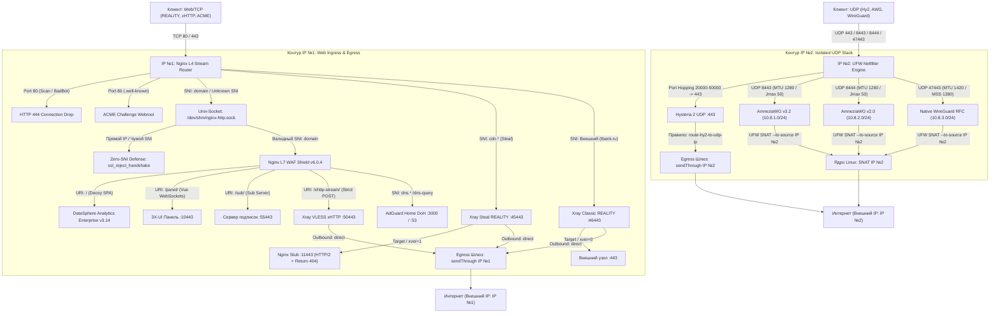

# 🛡️ Dual IP GateWay Node (Production Release v3.3.2 (Ultra Enhanced Production Architecture)
### Автоматизированный узел сетевой маскировки и туннелирования: OS Hardening + BBR + Nginx L4/L7 + 3X-UI + Xray v26.7.28 Pinned + VLESS xHTTP (Native H2C Stream-One) + ML-KEM-768 + Multi-Port REALITY + Stub 11443 + Zero-SNI Defense + Hysteria 2 + AWG v3.2/v2.0 (MTU 1280) + WireGuard Native + AdGuard Home DoH + Decoy Shield v3.14

[](https://ubuntu.com)
[](https://github.com/XTLS/Xray-core)
[](https://github.com/mhsanaei/3x-ui)
[](LICENSE)
[](LICENSE)

<p align="center">
  <b>Высокопроизводительный инженерный комплекс для развёртывания сетевой инфраструктуры обхода блокировок уровня Enterprise.</b><br>
  Реализует топологию Dual-IP Model 1 (полное физическое и логическое разделение чистого веб-трафика и изолированного UDP VPN стека), постквантовую криптографию ML-KEM-768, аппаратный L4-роутинг Nginx Mainline, защиту от активного сканирования Zero-SNI Shield, выделенный Stub 11443 для Steal-Oneself, оптимизированный стек AmneziaWG (MTU 1280) и полноценную интерактивную веб-маскировку DataSphere Analytics v3.14.
</p>

---

## 📑 Содержание

1. [Архитектура и сетевая топология Dual-IP Model 1](#-архитектура-и-сетевая-топология-dual-ip-model-1)
2. [Ключевые функциональные и защитные возможности](#-ключевые-функциональные-и-защитные-возможности)
3. [Системные требования и быстрый старт](#-системные-требования-и-быстрый-старт)
4. [Параметры мастера установки](#-параметры-мастера-установки)
5. [Боевые конфигурации инбаундов Xray-core](#-боевые-конфигурации-инбаундов-xray-core)
6. [Подписки и клиентская экосистема](#-подписки-и-клиентская-экосистема)
7. [Приватный DNS AdGuard Home (DoH)](#-приватный-dns-adguard-home-doh)
8. [Инженерный аудит и диагностика](#-инженерный-аудит-и-диагностика)
9. [Резервное копирование и откат](#-резервное-копирование-и-откат)
10. [Лицензия](#-лицензия)

---

## 🏗️ Архитектура и сетевая топология Dual-IP Model 1

Архитектура узла гарантирует нулевую корреляцию между чистым трафиком веб-ресурсов и высоконагруженными VPN-туннелями:

* **IP №1 (Web / TCP Ingress & Egress):**
  * Принимает исключительно TCP-трафик на порты `:80` (ACME + Hardened Drop) и `:443` (Nginx L4 Stream Router).
  * Обслуживает маскировочный портал DataSphere Analytics Enterprise v3.14, изолированную веб-панель 3X-UI, сервер выдачи подписок, протоколы VLESS REALITY и VLESS xHTTP.
  * Исходящий трафик веб-протоколов принудительно фиксируется ядром Xray через директиву `sendThrough: IP#1` (outbound `direct`). Внешние веб-серверы фиксируют только IP №1.
* **IP №2 (Isolated UDP VPN Stack Ingress & Egress):**
  * Обслуживает туннельные протоколы Hysteria 2 (порт `:443/udp` + Port Hopping `20000-50000/udp`), AmneziaWG v3.2 (порт `:8443/udp`), AmneziaWG v2.0 Legacy (порт `:8444/udp`) и Native WireGuard RFC (порт `:47443/udp`).
  * TCP-порты `:80` и `:443` на IP №2 полностью закрыты на уровне UFW — сканирование по TCP не выявляет веб-сервисов и TLS-сертификатов.
  * Исходящий трафик Hysteria 2 маршрутизируется ядром Xray через шлюз `direct-udp` (`sendThrough: IP#2`).
  * Исходящий трафик подсетей AmneziaWG (`10.8.1.0/24`, `10.8.2.0/24`) и WireGuard (`10.8.3.0/24`) транслируется на уровне ядра Linux строго через `SNAT --to-source IP#2`.



---

## ⚙️ Ключевые функциональные и защитные возможности

* **Zero-SNI Defense (`ssl_reject_handshake on`):**  
  Дефолтный сервер на unix-сокете и резервном порту `:9443` прерывает рукопожатие TLS на корню при обращении напрямую по IP-адресу или с невалидным SNI. Сканеры (Censys, Shodan, Masscan) не могут извлечь сертификат сервера.
* **Изолированный Stub 11443 для Steal-Oneself:**  
  Инбаунд Steal-Oneself передает fallback-трафик на специализированный виртуальный сервер `127.0.0.1:11443` с заголовком PROXY protocol v1 (`xver: 1`) и поддержкой HTTP/2, немедленно отдающий `404 Not Found`. Это исключает циклическую переадресацию и сбои сопоставления ALPN.
* **Порт 80 Hardened Drop (`return 444`):**  
  На открытом порту 80 обслуживаются только токены ACME (`/.well-known/acme-challenge/`). Любые попытки зондирования ботами, сканерами или обращения с пустым заголовком `Host` обрываются TCP-сбросом без отправки ответа (`return 444`).
* **VLESS xHTTP (Native H2C Stream-One) + ML-KEM-768:**  
  * Полнодуплексный двусторонний стриминг по протоколу HTTP/2 (`proxy_http_version 2;`) с полным отключением буферизации (`proxy_buffering off; proxy_request_buffering off;`).
  * Жесткая изоляция метода: доступ к пути стрима открыт строго для `POST`-запросов, любые `GET`-запросы получают `404`.
  * Интеграция постквантового алгоритма согласования ключей ML-KEM-768 (Kyber768) через `vlessenc`.
  * Рандомизированный паддинг `xPaddingBytes: 120-1120`, маскировка под AWS через `X-Amz-Meta-Trace` и мультиплексирование сессий `enableXmux: true`.
* **Оптимизация AmneziaWG (MTU 1280 / Zero PMTUD Blackhole):**  
  Параметры инбаундов приведены к стандарту `MTU 1280`, `Jc 3`, `Jmin 50`, `Jmax 50`, `contentPaddingAddition: "0"`, `disableCookies: true`, `randomTrailers: false`. Это полностью устраняет фрагментацию пакетов и зависание сессий в мобильных сетях.
* **Матрица безопасности WAF v6.0.4 Hardened:**  
  Двухуровневая система карт Nginx `$badbot_raw` и `$is_scan_attempt` блокирует сканеры (Nuclei, Gobuster, SQLmap, Nmap), агрессивные AI-краулеры (GPTBot, ClaudeBot, Perplexity, CCBot) и попытки path traversal к чувствительным файлам (`.env`, `.git`, `.aws`).
* **Интерактивный комплекс маскировки DataSphere Decoy v3.14:**  
  * Семантическая SPA-разметка корпоративной аналитической платформы распределенных данных.
  * Динамическая телеметрия ядра, функционирующая строго на базе нативного Web Cryptography API (`crypto.getRandomValues`).
  * Раздельный зональный CSP: нулевой `'unsafe-inline'` на основном сайте; совместимый профиль WebSockets/Vue на панели; разрешение `'unsafe-inline'` на путях подписок для корректного исполнения `window.__SUB_PAGE_DATA__`.
  * REST API заглушки: статус кластера `/api/v1/datasphere/status` (200 OK) и консоль узла `/api/v1/datasphere/auth` (константный 401 Unauthorized).
* **Синхронизация схемы ALPN в базе SQLite (3X-UI Zod Fix):**  
  Встроенный пре-миграционный скрипт Python нормализует записи `externalProxy.alpn` во всех таблицах SQLite, приводя их из строк к строгим JSON-массивам `["h2"]` / `["h3"]`, что предотвращает критические сбои Zod-валидатора в современных версиях панели.
* **Атомарная блокировка процесса и безопасность Bash:**  
  Моноскрипт защищен атомарным захватом `flock` на файловом дескрипторе 200, функцией ожидания снятия системных локов пакетов `wait_for_apt_lock()` и ловушкой `cleanup $LINENO`.

---

## 🚀 Системные требования и быстрый старт

### Требования к серверу:
* **Архитектура:** x86_64 (amd64) или ARM64 (aarch64).
* **ОС:** Ubuntu 22.04 / 24.04 / 26.04 LTS или Debian 12 / 13.
* **Ресурсы:** Минимум 1 vCPU, 1 ГБ RAM (при 512 МБ требуется swap), 10 ГБ на SSD/NVMe.
* **Сеть:** 2 публичных IPv4-адреса (допускается работа с 1 адресом в режиме Single-IP fallback).
* **DNS:** Основной домен и поддомены (`domain.com`, `cdn.domain.com`, `cdn2.domain.com`, `dns.domain.com`) должны быть направлены на сервер.

> [!CAUTION]
> ### ⚠️ Настройка DNS в Cloudflare
> Все A-записи домена и поддоменов в личном кабинете Cloudflare должны находиться строго в режиме **DNS-Only (Серое облако)**.  
> Проксирование через Cloudflare (Оранжевое облако) блокирует протоколы REALITY, разрушает мультиплексирование L4 Stream и отсекает весь входящий UDP-трафик.

### Запуск развёртывания:

Выполните команду на сервере под учетной записью суперпользователя `root`:

```bash
bash <(curl -fsSL https://raw.githubusercontent.com/Itman75/Dual-ip-GateWay/main/install.sh)
```

Резервный запуск через `wget`:

```bash
wget -qO- https://raw.githubusercontent.com/Itman75/Dual-ip-GateWa/main/install.sh | bash
```

---

## 📋 Параметры мастера установки

| Этап | Параметр | Значение по умолчанию | Описание назначения |
| :--- | :--- | :--- | :--- |
| **Режим** | Режим работы | `2` (при наличии БД) | `1` — Clean Install (сброс базы, новые ключи, генерация профиля Test); `2` — Safe Migration (100% сохранение клиентов, ключей, UUID, горячий бэкап `.tar.gz` и авто-патч схемы ALPN). |
| **0** | IP №1 (Web/TCP) | Автоопределение | Публичный IPv4 для Nginx L4/L7, VLESS REALITY, VLESS xHTTP, ACME и панели 3X-UI. |
| **0** | IP №2 (UDP VPN) | Автоопределение | Публичный IPv4 для Hysteria 2, AmneziaWG v3.2, AmneziaWG v2.0 и Native WireGuard RFC. |
| **0** | Гео-профиль | Автоопределение (RU/EU)| Оптимизация резолверов (Яндекс DNS 77.88.8.8 vs Cloudflare 1.1.1.1) и CDN-зеркал загрузки бинарников. |
| **1** | Доменная зона | — | Основной домен (A-запись на IP №1) и поддомен UDP (A-запись на IP №2). |
| **2** | Системный Hardening | `y` | TCP BBR, Somaxconn 65535, Loose `rp_filter = 2`, `ip_nonlocal_bind = 1`, отключение IPv6. |
| **2** | SSH-периметр | Текущий порт | Смена порта SSH, блокировка входа по паролю, генерация ключей Ed25519, интеграция с Fail2ban. |
| **3** | Секретные пути | Случайные URI | Настройка закрытых URI для панели управления, сервера подписок и xHTTP-стрима. |
| **4** | Матрица REALITY | `y` (`:45443` / `:46443`)| Привязка Steal-Oneself к поддоменам (Stub 11443) и Classic к внешним SNI с TLS 1.3 RTT-бенчмарком. |
| **6** | UDP-туннели | `y` | Выбор активации Hysteria 2 (с Port Hopping), AmneziaWG v3.2, AmneziaWG v2.0 и WireGuard Native. |
| **7** | Приватный DoH | `y` (`dns.domain`)| Развёртывание AdGuard Home DoH со сплит-DNS и роутерной токенизацией `ClientID`. |

> [!IMPORTANT]
> **Обязательные действия после завершения установки:**  
> 1. Откройте **новое отдельное окно терминала** и проверьте доступ к серверу по SSH на установленном порту.  
> 2. В исходной консоли выполните команду: `reboot`.  
> После перезагрузки сетевые параметры ядра, трансляция адресов в UFW и фоновые демоны инициализируются в целевом стабильном состоянии.

---

## 📄 Боевые конфигурации инбаундов Xray-core

<details>
<summary><b>1. VLESS xHTTP Stream-One + ML-KEM-768 + XMUX + Vision (Порт :50443)</b></summary>

```json
{
  "listen": "127.0.0.1",
  "port": 50443,
  "protocol": "vless",
  "tag": "in-xhttp-stream",
  "settings": {
    "clients": [
      {
        "id": "ВАШ_UUID",
        "flow": "xtls-rprx-vision",
        "email": "Test",
        "subId": "SUB_Test",
        "enable": true
      }
    ],
    "decryption": "mlkem768_СЕРВЕРНЫЙ_КЛЮЧ",
    "encryption": "mlkem768_КЛИЕНТСКИЙ_КЛЮЧ"
  },
  "sniffing": {
    "enabled": true,
    "destOverride": ["http", "tls", "quic", "fakedns"]
  },
  "streamSettings": {
    "network": "xhttp",
    "xhttpSettings": {
      "path": "/Stream-One-Path/",
      "host": "yourdomain.online",
      "mode": "stream-one",
      "noSSEHeader": true,
      "xPaddingBytes": "120-1120",
      "xPaddingObfsMode": true,
      "xPaddingKey": "X-Amz-Meta-Trace",
      "xmux": {
        "maxConcurrency": "0",
        "maxConnections": "1-3",
        "cMaxReuseTimes": "300-600",
        "hMaxRequestTimes": "600-900",
        "hMaxReusableSecs": "1800-3000",
        "hKeepAlivePeriod": 600
      },
      "enableXmux": true
    },
    "security": "none",
    "externalProxy": [
      {
        "dest": "yourdomain.online",
        "port": 443,
        "forceTls": "tls",
        "sni": "yourdomain.online",
        "fingerprint": "firefox",
        "alpn": ["h2"],
        "remark": "VLESS xHTTP"
      }
    ]
  }
}
```
</details>

<details>
<summary><b>2. VLESS REALITY Steal-Oneself (Порт :45443, Stub :11443, xver 1)</b></summary>

```json
{
  "listen": "127.0.0.1",
  "port": 45443,
  "protocol": "vless",
  "tag": "in-steal-reality",
  "settings": {
    "clients": [
      {
        "id": "ВАШ_UUID",
        "flow": "xtls-rprx-vision",
        "email": "Test",
        "subId": "SUB_Test",
        "enable": true
      }
    ],
    "decryption": "none"
  },
  "streamSettings": {
    "network": "tcp",
    "security": "reality",
    "tcpSettings": {
      "acceptProxyProtocol": true,
      "header": { "type": "none" }
    },
    "realitySettings": {
      "show": false,
      "xver": 1,
      "target": "127.0.0.1:11443",
      "dest": "127.0.0.1:11443",
      "serverNames": ["cdn.yourdomain.online"],
      "privateKey": "ВАШ_PRIVATE_KEY",
      "minClientVer": "1.0.0",
      "shortIds": ["ВАШ_SHORT_ID"],
      "settings": {
        "publicKey": "ВАШ_PUBLIC_KEY",
        "fingerprint": "firefox",
        "spiderX": "/"
      }
    },
    "externalProxy": [
      {
        "dest": "yourdomain.online",
        "port": 443,
        "forceTls": "same",
        "remark": "REALITY-443"
      }
    ]
  }
}
```
</details>

<details>
<summary><b>3. Hysteria 2 UDP (Порт :443 на IP №2, ALPN: h3)</b></summary>

```json
{
  "listen": "IP_НОМЕР_2",
  "port": 443,
  "protocol": "hysteria",
  "tag": "in-hysteria2",
  "settings": {
    "clients": [
      {
        "auth": "ТОКЕН_АВТОРИЗАЦИИ",
        "password": "ТОКЕН_АВТОРИЗАЦИИ",
        "email": "Test",
        "enable": true
      }
    ],
    "version": 2
  },
  "streamSettings": {
    "network": "hysteria",
    "hysteriaSettings": {
      "version": 2,
      "udpIdleTimeout": 60,
      "masquerade": { "type": "proxy", "url": "http://127.0.0.1:80" }
    },
    "security": "tls",
    "tlsSettings": {
      "serverName": "cdn2.yourdomain.online",
      "minVersion": "1.3",
      "maxVersion": "1.3",
      "certificates": [
        {
          "certificateFile": "/etc/letsencrypt/live/cdn2.yourdomain.online/fullchain.pem",
          "keyFile": "/etc/letsencrypt/live/cdn2.yourdomain.online/privkey.pem"
        }
      ],
      "alpn": ["h3"]
    },
    "externalProxy": [
      {
        "dest": "cdn2.yourdomain.online",
        "port": 443,
        "forceTls": "tls",
        "alpn": ["h3"],
        "remark": "Hysteria 2"
      }
    ]
  }
}
```
</details>

<details>
<summary><b>4. AmneziaWG v3.2 (Порт :8443 на IP №2, MTU 1280 / Jmax 50)</b></summary>

```json
{
  "listen": "IP_НОМЕР_2",
  "port": 8443,
  "protocol": "amneziawg",
  "tag": "in-8443-udp",
  "settings": {
    "clients": [
      {
        "id": "ВАШ_UUID",
        "email": "Test",
        "subId": "SUB_Test",
        "allowedIPs": ["10.8.1.3/32"],
        "enable": true
      }
    ],
    "server": {
      "h1": "СЛУЧАЙНОЕ_ЧИСЛО_1",
      "h2": "СЛУЧАЙНОЕ_ЧИСЛО_2",
      "h3": "СЛУЧАЙНОЕ_ЧИСЛО_3",
      "h4": "СЛУЧАЙНОЕ_ЧИСЛО_4",
      "jc": 3,
      "jmin": 50,
      "jmax": 50,
      "s1": 45,
      "s2": 60,
      "s3": 24,
      "s4": 16,
      "mtu": 1280,
      "primaryDns": "77.88.8.8",
      "secondaryDns": "77.88.8.1",
      "privateKey": "СЕРВЕРНЫЙ_PRIVATE_KEY",
      "publicKey": "СЕРВЕРНЫЙ_PUBLIC_KEY",
      "randomTrailers": false,
      "disableCookies": true,
      "contentPaddingAddition": "0",
      "keepaliveTimeout": "20-25",
      "rekeyAfterTime": "300-500",
      "rekeyTimeout": "10-15",
      "rejectAfterTime": "600-900",
      "maxHandshakeAttempts": "10-15",
      "subnetCidr": 24,
      "subnetIp": "10.8.1.0"
    }
  },
  "streamSettings": {
    "externalProxy": [
      {
        "dest": "cdn2.yourdomain.online",
        "port": 8443,
        "remark": "AmneziaWG v3"
      }
    ]
  }
}
```
</details>

<details>
<summary><b>5. Native WireGuard RFC (Порт :47443 на IP №2, MTU 1420)</b></summary>

```json
{
  "listen": "IP_НОМЕР_2",
  "port": 47443,
  "protocol": "wireguard",
  "tag": "in-wireguard-native",
  "settings": {
    "secretKey": "СЕРВЕРНЫЙ_PRIVATE_KEY",
    "peers": [
      {
        "publicKey": "КЛИЕНТСКИЙ_PUBLIC_KEY",
        "allowedIPs": ["10.8.3.3/32"],
        "keepAlive": 25,
        "email": "Test"
      }
    ],
    "mtu": 1420,
    "noKernelTun": false
  },
  "streamSettings": {
    "externalProxy": [
      {
        "dest": "cdn2.yourdomain.online",
        "port": 47443,
        "remark": "WireGuard Native"
      }
    ]
  }
}
```
</details>

<details>
<summary><b>6. Исходящая маршрутизация Dual-IP (Strict sendThrough)</b></summary>

```json
{
  "outbounds": [
    {
      "tag": "direct",
      "protocol": "freedom",
      "sendThrough": "IP_НОМЕР_1",
      "settings": {
        "finalRules": [
          {"action": "allow", "ip": ["127.0.0.1"], "port": "53"},
          {"action": "allow", "ip": ["10.8.1.0/24", "10.8.2.0/24", "10.8.3.0/24"]},
          {"action": "block", "ip": ["geoip:private"]},
          {"action": "allow"}
        ]
      },
      "streamSettings": {
        "sockopt": { "domainStrategy": "ForceIPv4" }
      }
    },
    {
      "tag": "direct-udp",
      "protocol": "freedom",
      "sendThrough": "IP_НОМЕР_2",
      "settings": {
        "finalRules": [
          {"action": "allow", "ip": ["127.0.0.1"], "port": "53"},
          {"action": "block", "ip": ["geoip:private"]},
          {"action": "allow"}
        ]
      },
      "streamSettings": {
        "sockopt": { "domainStrategy": "ForceIPv4" }
      }
    },
    {
      "tag": "blocked",
      "protocol": "blackhole",
      "settings": {}
    }
  ],
  "routing": {
    "domainStrategy": "IPIfNonMatch",
    "rules": [
      {
        "type": "field",
        "inboundTag": ["in-hysteria2"],
        "outboundTag": "direct-udp",
        "ruleTag": "route-hy2-to-udp-ip"
      },
      {
        "type": "field",
        "ip": ["127.0.0.1"],
        "port": "53",
        "outboundTag": "direct",
        "ruleTag": "xui-dns-allow"
      },
      {
        "type": "field",
        "ip": ["10.8.1.0/24", "10.8.2.0/24", "10.8.3.0/24"],
        "outboundTag": "direct"
      },
      {
        "type": "field",
        "ip": ["geoip:private"],
        "outboundTag": "blocked"
      },
      {
        "type": "field",
        "protocol": ["bittorrent"],
        "outboundTag": "blocked"
      }
    ]
  }
}
```
</details>

---

## 📱 Подписки и клиентская экосистема

Служебные реквизиты доступа и клиентские ключи сохраняются в защищенном файле `/root/vpn_credentials.txt` (`chmod 600`).  
В режиме чистой установки генерируются следующие мультипротокольные эндпоинты:

* **Адаптивная подписка (Base64 / Web Dashboard):**  
  `https://yourdomain.online/my-post-key/SUB_Test`  
  *(При открытии браузером отдает интерфейс статистики с возможностью прямого копирования; при запросе клиентом — чистый Base64/YAML).*
* **Выделенная подписка JSON (Sing-box v1.10+ / Happ / Karing / SFI):**  
  `https://yourdomain.online/my-post-key/sub-json/SUB_Test`
* **Выделенная подписка Clash / Mihomo YAML:**  
  `https://yourdomain.online/sub-clash/SUB_Test`
* **Конфигурация Native WireGuard RFC:**  
  `/root/wireguard-client.conf` (MTU 1420 / MSS 1380).

### Матрица поддержки протоколов:

| Клиентское ПО | Платформа | VLESS REALITY | VLESS xHTTP (ML-KEM-768) | Hysteria 2 | AmneziaWG v3.2 / v2.0 | WireGuard Native |
| :--- | :--- | :---: | :---: | :---: | :---: | :---: |
| **v2rayNG** | Android | ✔️ | ✔️ (Xray core) | ✔️ | ❌ | ❌ |
| **v2rayN** (v6.40+) | Windows | ✔️ | ✔️ (Xray core) | ✔️ | ❌ | ❌ |
| **Happ Proxy** | iOS, iPadOS | ✔️ | ✔️ (Xray core) | ✔️ | ✔️ (AWG v3.2) | ✔️ |
| **NekoBox (NB+)** | Android | ✔️ | ❌ *(нет ML-KEM)* | ✔️ | ✔️ | ✔️ |
| **Mihomo Party / Clash Verge** | Desktop | ✔️ | ✔️ | ✔️ | ❌ | ❌ |
| **KeeneticOS / OpenWrt** | Роутеры | ✔️ | ✔️ | ✔️ | ✔️ (AWG v2.0) | ✔️ (.conf) |

---

## 🌐 Приватный DNS AdGuard Home (DoH)

Локальный резолвер AdGuard Home изолирован на `127.0.0.1:3000` и обслуживает запросы через Nginx-шлюз с проверкой ClientID-токена. Внешний доступ к 53 порту перекрыт.

* **Панель управления DNS:** `https://dns.yourdomain.online/`
* **DoH URL для сетевых устройств:** `https://dns.yourdomain.online/dns-query/home-router`

### Настройка на роутерах Keenetic (KeeneticOS 3.x / 4.x):
1. Откройте веб-интерфейс -> **«Сетевые правила»** -> **«Интернет-фильтр»** (вкладка «Серверы DNS»).
2. Добавьте сервер DNS:
   * **Адрес DNS (Bootstrap):** `77.88.8.8` или `1.1.1.1` *(указывать внешний IP VPS запрещено во избежание циклического запроса)*;
   * **Протокол:** `DNS-over-HTTPS (DoH)`;
   * **URL-адрес:** `https://dns.yourdomain.online/dns-query/home-router`;
   * **SNI:** `dns.yourdomain.online`.
3. Установите чекбокс **«Игнорировать DNS провайдера»** и сохраните конфигурацию.

---

## 🩺 Инженерный аудит и диагностика

Служебный набор команд для проверки состояния сетевой подсистемы:

```bash
# 1. Проверка синтаксиса и статуса Nginx Mainline L4/L7
nginx -t && systemctl status nginx --no-pager

# 2. Инспекция Unix-сокета Nginx в памяти RAM
ls -la /dev/shm/nginx-http.sock

# 3. Верификация ответа веб-маскировки DataSphere Enterprise (HTTP/2)
curl -Iv --http2 https://yourdomain.online

# 4. Проверка Zero-SNI Defense (рукопожатие TLS обязано сбрасываться при обращении по IP)
curl -Iv https://IP_НОМЕР_1 2>&1 | grep -E 'SSL|handshake|alert'

# 5. Проверка изоляции VLESS xHTTP (строго HTTP 404 на GET-запрос)
curl -Iv --http2 https://yourdomain.online/Stream-One-Path/

# 6. Инспекция Stub 11443 для Steal-Oneself (должен отдавать 404)
curl -Iv --http2 http://127.0.0.1:11443 2>&1 | head -n 15

# 7. Инспекция локальных слушающих сокетов
ss -tlnp | grep -E '10443|55443|50443|45443|46443|9443|11443|3000'

# 8. Инспекция UDP-сокетов на IP №2 (Hysteria 2, WireGuard, AWG)
ss -ulnp | grep -E '443|8443|8444|47443'

# 9. Проверка правил UFW, SNAT на IP №2 и MSS Clamping
ufw status verbose
iptables -t nat -L POSTROUTING -n -v
iptables -t mangle -L FORWARD -n -v

# 10. Проверка версии зафиксированного бинарника Xray-core
/usr/local/x-ui/bin/xray version

# 11. Инспекция записей БД 3X-UI SQLite
sqlite3 /etc/x-ui/x-ui.db "SELECT id, remark, port, protocol, enable FROM inbounds;"
sqlite3 /etc/x-ui/x-ui.db "SELECT id, email, sub_id, enable FROM clients;"
sqlite3 /etc/x-ui/x-ui.db "SELECT id, remark, address, port, path, alpn FROM hosts;"
```

---

## 💾 Резервное копирование и откат

### Создание атомарного горячего бэкапа:
```bash
python3 -c "import sqlite3; c=sqlite3.connect('/etc/x-ui/x-ui.db'); c.execute('PRAGMA wal_checkpoint(FULL);'); c.close()" 2>/dev/null || true
tar -czvf /root/backup_vpn_$(date +%F_%H%M%S).tar.gz \
  /etc/x-ui \
  /etc/nginx \
  /etc/letsencrypt \
  /etc/ssl/acme \
  /opt/AdGuardHome/AdGuardHome.yaml \
  /var/www/html \
  /etc/ufw/before.rules 2>/dev/null || true
chmod 600 /root/backup_vpn_*.tar.gz
```

### Восстановление системы:
```bash
systemctl stop x-ui nginx AdGuardHome 2>/dev/null || true
rm -f /etc/x-ui/x-ui.db-wal /etc/x-ui/x-ui.db-shm
tar -xzvf /root/backup_vpn_ГГГГ-ММ-ДД_ЧЧММСС.tar.gz -C /
nginx -t && systemctl start nginx x-ui AdGuardHome
```

---

## 📄 Лицензия

Проект распространяется на условиях открытой лицензии **MIT**. Полный юридический текст представлен в файле [LICENSE](LICENSE).
